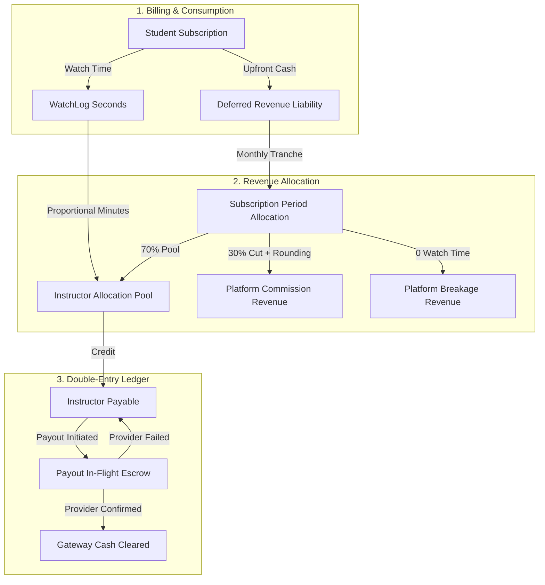

# Instructor Revenue Ledger

> **Career 180 Technical Challenge** — A financial ledger and payout engine for a subscription-based educational platform. Engineered with an immutable double-entry ledger, consumption-based proportional revenue allocation, resilient idempotent payout orchestration, mid-term refund handling with zero clawbacks, and a strictly read-only administrative dashboard built on Filament 3.

---

## Table of Contents

- [Overview & Problem Statement](#overview--problem-statement)
- [System Architecture & Invariants](#system-architecture--invariants)
  - [1. Proportional Watch-Time Allocation (ADR-002)](#1-proportional-watch-time-allocation-adr-002)
  - [2. Accrual Accounting & Deferred Revenue (ADR-003)](#2-accrual-accounting--deferred-revenue-adr-003)
  - [3. Floor Allocation & Platform Absorption (ADR-004)](#3-floor-allocation--platform-absorption-adr-004)
  - [4. Double-Entry Immutable Ledger (ADR-005)](#4-double-entry-immutable-ledger-adr-005)
  - [5. Payout State Machine & Two-Phase Escrow (ADR-006 & ADR-007)](#5-payout-state-machine--two-phase-escrow-adr-006--adr-007)
  - [6. Mid-Term Refunds Without Clawbacks (ADR-008)](#6-mid-term-refunds-without-clawbacks-adr-008)
- [Technology Stack](#technology-stack)
- [Docker Setup & Installation](#docker-setup--installation)
- [Filament Admin Panel](#filament-admin-panel)
- [Artisan CLI Commands](#artisan-cli-commands)
- [Automated Test Suite](#automated-test-suite)
- [Engineering Documentation](#engineering-documentation)

---

## Overview & Problem Statement

In subscription-based learning platforms, students pay upfront for catalog access (monthly, quarterly, or annually). At month-end, subscription revenue must be distributed fairly to instructors based on actual consumption (watch time) while maintaining mathematical precision, zero floating-point drift, complete auditability, and safety against network failures or duplicate payouts.

### Key Engineering Highlights:
- **Zero Floating-Point Arithmetic:** All money stored as `BIGINT UNSIGNED` in minor currency units (cents/piastres) with `ext-bcmath` precision.
- **Consumption-Based Allocation:** Revenue split proportionally by minutes watched per student per instructor.
- **Handling Student Inactivity (Breakage):** When a student has 0 watch time during an active month, 100% of the recognized monthly tranche accrues to the platform as breakage revenue.
- **Accrual Revenue Recognition:** Upfront multi-month payments sit in `Customer Deferred Revenue` (liability) and are recognized in equal monthly tranches.
- **Double-Entry Ledger:** Immutable journal transactions (`LedgerTransaction`) and balanced debit/credit lines (`LedgerEntry`) enforcing $\sum \text{Debits} \equiv \sum \text{Credits}$.
- **Pessimistic Payout Concurrency:** `lockForUpdate()` database locks and a two-phase escrow hold (`liabilities:instructor:payout_in_flight`) eliminate race conditions.
- **Provider Timeout Reconciliation:** Network timeouts transition payouts to `pending_reconciliation` without releasing escrow, resolved via scheduled status inquiries.
- **Read-Only Administrative Interface:** Filament 3 panel with disabled mutation endpoints (`create`, `edit`, `delete`) to protect ledger immutability.

---

## System Architecture & Invariants



### 1. Proportional Watch-Time Allocation (ADR-002)
For each active subscription billing period:
1. Platform retains its contractual share (e.g., 30% platform cut).
2. The remaining 70% forms the instructor revenue pool.
3. Each instructor's share is calculated as:
   $$\text{Instructor Share} = \text{floor}\left( \text{Instructor Pool} \times \frac{\text{Instructor Watch Minutes}}{\text{Total Student Watch Minutes in Period}} \right)$$

### 2. Accrual Accounting & Deferred Revenue (ADR-003)
Upfront payments for multi-month or annual plans are credited to `liabilities:deferred_revenue`. Each month, $\frac{1}{N}$ of the subscription fee is recognized.

### 3. Floor Allocation & Platform Absorption (ADR-004)
To prevent creating or losing minor currency units due to fractional sub-cents, each instructor's share is floored to integer cents, and the platform absorbs the residual cents into its commission. This strictly guarantees:
$$\text{Total Recognized Amount} \equiv \text{Platform Cut} + \sum \text{Instructor Shares}$$

### 4. Double-Entry Immutable Ledger (ADR-005)
Standard chart of accounts:
- `assets:gateway`: Transit cash held at payment provider.
- `liabilities:deferred_revenue`: Unearned customer revenue.
- `liabilities:instructor:payable:{id}`: Owed to instructor (withdrawable balance).
- `liabilities:instructor:payout_in_flight:{id}`: Payout escrow hold.
- `revenues:platform:commission`: Platform subscription commission.
- `revenues:platform:breakage`: Unclaimed pool from inactive students.

### 5. Payout State Machine & Two-Phase Escrow (ADR-006 & ADR-007)
```
DRAFT -> PROCESSING (funds moved to escrow)
          ├── COMPLETED (funds move from escrow to gateway)
          ├── FAILED (funds restored from escrow to payable)
          └── PENDING_RECONCILIATION (funds held in escrow until status checked)
```

### 6. Mid-Term Refunds Without Clawbacks (ADR-008)
When a student cancels mid-term, the refundable amount is:
$$\text{Refundable Amount} = \text{Total Paid} - \sum \text{Recognized Monthly Tranches}$$
- Past months where instructors delivered content are retained by instructors.
- Only unearned deferred revenue is returned to the student.
- Zero instructor clawbacks or negative balance risks.

---

## Technology Stack

- **Framework:** Laravel 11.x
- **Language / Runtime:** PHP 8.2 (`ext-bcmath`, `ext-intl`, `ext-zip`, `ext-pdo_mysql`)
- **Database:** MySQL 8.0 (InnoDB, strict constraints, composite indexes)
- **Admin Panel:** Filament 3.3 & Livewire 3
- **Testing:** Pest & PHPUnit 10.5
- **Containerization:** Docker & Docker Compose

---

## Docker Setup & Installation

### 1. Clone the repository
```bash
git clone https://github.com/AhmedAbdEllatif7/instructor-revenue-ledger.git
cd instructor-revenue-ledger
```

### 2. Start the Docker containers
```bash
docker compose up -d
```
The containers will start:
- `instructor-revenue-ledger` (PHP 8.2 + Laravel) on port `8000`
- `mysql-instructor` (MySQL 8.0) on port `3307`
- `phpmyadmin-instructor` on port `8080`

### 3. Run database migrations & seeders
```bash
docker compose exec instructor-revenue-ledger php artisan migrate:fresh --seed
```

---

## Filament Admin Panel

The administrative panel provides read-only visibility into instructor balances, lifetime platform earnings, and payout audit logs.

- **URL:** [http://localhost:8000/admin](http://localhost:8000/admin)
- **Admin Email:** `admin@career180.com`
- **Password:** `password`

### Available Screens:
1. **Financial Dashboard (`/admin`):**
   - Live `LedgerStatsOverview` widget tracking Deferred Revenue, Instructor Payables, Platform Commission, Disbursed Payouts, Escrow Holds, and Breakage.
2. **Instructor Balances (`/admin/instructor-balances`):**
   - Lists instructors with course counts, withdrawable balances, and lifetime earnings.
   - Comprehensive Infolist view with full financial breakdown.
3. **Payout History (`/admin/payouts`):**
   - Detailed history of all payouts with status badges, period keys, idempotency keys, provider transfer references, and failure reasons.
   - Strictly read-only (`create`, `edit`, `delete` return 404).

---

## Artisan CLI Commands

### 1. Process Monthly Payouts
Orchestrates payouts for all instructors with positive balances for a given period using memory-safe `chunkById(100)`:
```bash
docker compose exec instructor-revenue-ledger php artisan payout:process --period=2026-09
```
- Dispatches queued `ProcessInstructorPayoutJob` with exponential backoff (`$backoff = [10, 60, 300]`).
- Supports `--sync` flag to execute synchronously in CLI.

### 2. Reconcile Pending Payouts
Polls the payment provider to resolve payouts in `pending_reconciliation` status:
```bash
docker compose exec instructor-revenue-ledger php artisan payout:reconcile
```
- Processes records using `chunkById(50)`.
- Updates confirmed payouts to `completed` and failed ones to `failed` (releasing escrow).

---

## Automated Test Suite

The test suite covers all financial logic, edge cases, double-entry invariants, and concurrency scenarios.

### Run All Tests:
```bash
docker compose exec instructor-revenue-ledger php artisan test
```

### Test Suite Breakdown (38 tests, 155 assertions):
| Test File | Test Count | Key Behaviors Verified |
| :--- | :--- | :--- |
| `DomainModelDatabaseTest` | 6 tests | Composite indexes, database-level unique constraints, role scopes |
| `RevenueAllocationTest` | 5 tests | Proportional watch-time math, floor rounding, breakage handling, idempotency |
| `LedgerAndBalancesTest` | 4 tests | Deferred revenue booking, double-entry balance validation, unbalance rollback |
| `PayoutProcessingTest` | 7 tests | State machine transitions, two-phase escrow hold, timeout recovery, duplicate command/job idempotency |
| `RefundTest` | 7 tests | Unearned deferred revenue refund, zero clawbacks on recognized months, balanced refund ledger |
| `FilamentScreenTest` | 7 tests | Authentication, dashboard stats widget, balance listing, payout view infolist, strict read-only enforcement |

---

## Engineering Documentation

Detailed engineering decisions and architectural specifications are documented in the `docs/` directory:
- [**docs/ARCHITECTURE.md**](docs/ARCHITECTURE.md) — Comprehensive bounded contexts, entity design, sequence diagrams, and scalability considerations.
- [**docs/DECISIONS.md**](docs/DECISIONS.md) — Architecture Decision Records (ADR-001 through ADR-009).
- [**docs/AI_USAGE.md**](docs/AI_USAGE.md) — Human-AI collaborative engineering methodology, failure mode analysis, and rejected alternatives.
