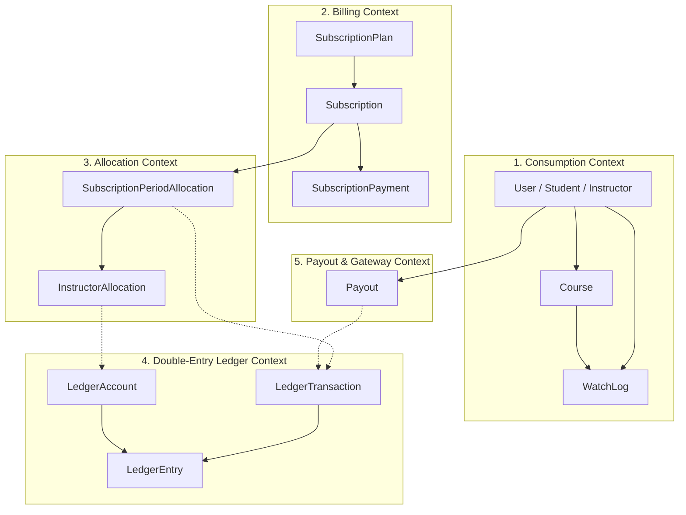
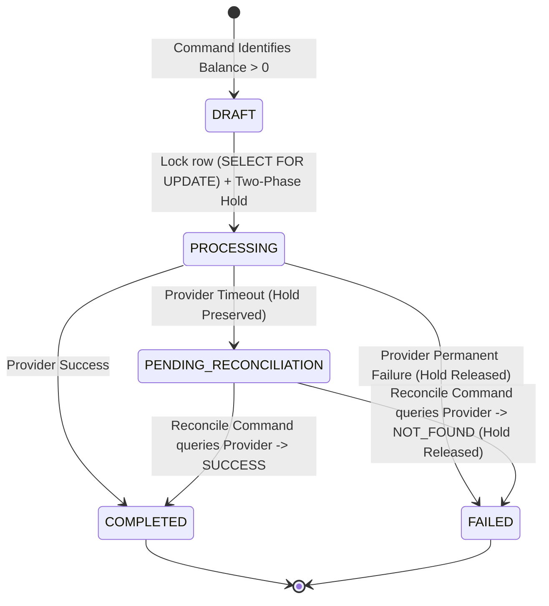
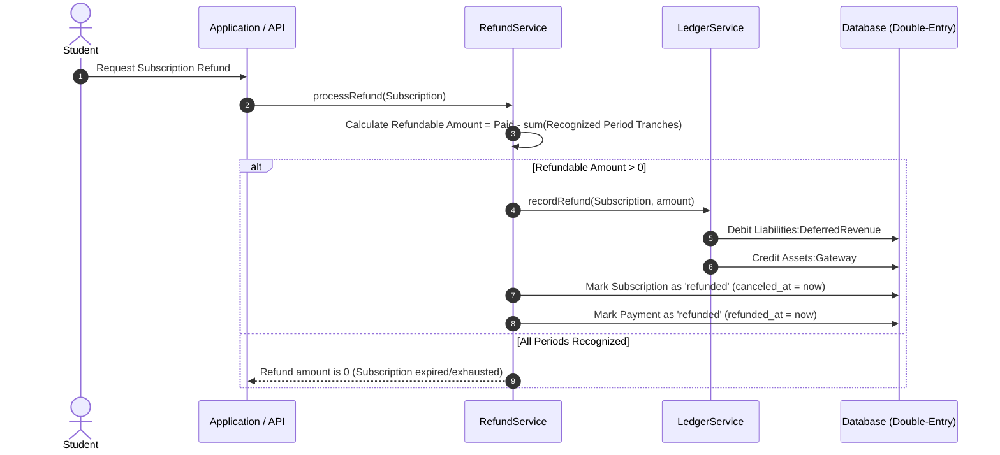

# Architecture Documentation

## Overview

The **Instructor Revenue Ledger** is a financial core designed for an online educational subscription platform. It handles subscription billing, consumption tracking (watch time), monthly revenue allocation across instructors, an immutable double-entry ledger, and a safe, idempotent payout orchestration engine.

---

## 1. Domain Entities & Bounded Contexts

The system is decomposed into five bounded contexts:



### Entity Responsibilities:

1. **User**: Represents platform actors with distinct roles (`student`, `instructor`, `admin`).
2. **Course**: Content owned by an instructor.
3. **WatchLog**: High-throughput consumption record storing student seconds watched per course/instructor per period.
4. **SubscriptionPlan**: Tier definitions (Monthly, Quarterly, Annual) with duration and price in cents.
5. **Subscription**: Student's active subscription contract with predefined monthly recognized tranches.
6. **SubscriptionPayment**: Inbound payment record linked to the subscription with external gateway reference for idempotency.
7. **SubscriptionPeriodAllocation**: Monthly recognition record for a subscription, calculating platform cut vs. instructor pool.
8. **InstructorAllocation**: Granular instructor share derived from watch-time proportions.
9. **LedgerAccount**: Chart of accounts categorized by accounting type (`asset`, `liability`, `equity`, `revenue`, `expense`).
10. **LedgerTransaction**: Immutable journal header with unique reference number (idempotency key).
11. **LedgerEntry**: Immutable balanced debit/credit lines.
12. **Payout**: Instructor withdrawal request with strict lifecycle status and duplicate-prevention constraints.

---

## 2. Double-Entry Ledger Model (ADR-005)

Every financial movement is represented by a balanced `LedgerTransaction` containing at least two `LedgerEntry` records where:

$$\sum \text{Debits} = \sum \text{Credits}$$

### Standard Accounts:
- `assets:gateway`: In-transit cash held at the payment provider.
- `liabilities:deferred_revenue`: Unearned revenue collected upfront for future monthly tranches (ADR-003).
- `liabilities:instructor:payable:{instructor_id}`: Earnings owed to instructors available for withdrawal.
- `liabilities:instructor:payout_in_flight:{instructor_id}`: Escrow account holding funds while a payout is being processed by the external gateway.
- `revenues:platform:commission`: Platform fee earned from subscription service.
- `revenues:platform:breakage`: Unclaimed pool revenue when a student has 0 watch time during an active period (ADR-002).

---

## 3. High-Scale Design & Database Optimizations

The system is architected to handle 500,000 active subscriptions and tens of millions of watch log records:

1. **Denormalization for Query Performance**:
   - `watch_logs.instructor_id` is denormalized directly onto the log row. This avoids a heavy relational `JOIN` against `courses` when aggregating millions of watch logs during month-end batch processing.
2. **Partition-Ready Period Keys (`period_key`)**:
   - Every consumption, allocation, and payout record includes a standard `YYYY-MM` string (`period_key`). This allows MySQL Range or List Partitioning by period if datasets exceed single-table performance thresholds.
3. **Targeted Composite Indexes**:
   - `watch_logs`: `['period_key', 'student_id']`, `['period_key', 'instructor_id']`, and `['period_key', 'student_id', 'instructor_id']`.
   - `subscriptions`: `['student_id', 'status']` and `['status', 'ends_at']`.
   - `ledger_entries`: `['ledger_account_id', 'created_at']` for near-instant balance reconstruction.

---

## 4. Idempotency & Concurrency Invariants

Financial correctness is enforced by hard database constraints to prevent race conditions and duplicate executions:

1. **Revenue Allocation Idempotency**:
   - Table `subscription_period_allocations` has a composite unique constraint: `unique(['subscription_id', 'period_key'])`.
   - Re-running the monthly allocation command will automatically fail at the database level if a period was already allocated.
2. **Payout Duplicate Prevention**:
   - Table `payouts` enforces `unique(['instructor_id', 'period_key'])`.
   - An instructor can NEVER receive more than one payout for the same accounting period, even across concurrent queue workers or duplicate artisan runs.
3. **Payment Idempotency**:
   - `subscription_payments.external_reference` is unique.
   - `payouts.idempotency_key` is unique.
4. **Zero Floating-Point Drift (ADR-001)**:
   - All financial amounts are stored as `BIGINT UNSIGNED` in minor currency units (cents/piastres).

---

## 5. Payout State Machine & Two-Phase Escrow Hold

To prevent duplicate payouts under race conditions, worker crashes, or external timeouts, the payout lifecycle operates as an atomic finite state machine:



### The Two-Phase Escrow Hold:
1. **Phase 1 (Debit Hold):** When a payout transitions to `processing`, a double-entry ledger transaction debits `Liabilities:Instructor:Payable` and credits `Liabilities:Instructor:PayoutInFlight`. This instantly reduces the instructor's withdrawable balance before any network call.
2. **Phase 2 (Settlement or Release):**
   - **On Success:** Funds move from `Liabilities:Instructor:PayoutInFlight` (debit) to `Assets:Gateway` (credit).
   - **On Permanent Failure:** Funds move from `Liabilities:Instructor:PayoutInFlight` (debit) back to `Liabilities:Instructor:Payable` (credit), restoring the instructor's balance.
   - **On Timeout:** Funds remain locked in `PayoutInFlight` until the `payout:reconcile` command checks provider status. Money is never released prematurely.

---

## 6. Mock Payment Provider Architecture

The external payment gateway abstraction is implemented via `PayoutProviderInterface`:

```php
interface PayoutProviderInterface
{
    public function payout(Payout $payout, string $idempotencyKey): PayoutResponse;
    public function checkStatus(string $idempotencyKey): PayoutResponse;
}
```

The `MockPayoutProvider` simulates 4 distinct real-world gateway scenarios:
1. **Mode `SUCCESS`:** Generates an external provider transfer reference (`TRF-XXXX`) and returns `STATUS_SUCCESS`.
2. **Mode `PERMANENT_FAILURE`:** Returns `STATUS_FAILED` with an explicit diagnostic reason (e.g., invalid bank details).
3. **Mode `TIMEOUT_AFTER_SUCCESS`:** Moves money internally at the gateway and records the successful transfer, but deliberately drops the HTTP connection and throws `PayoutProviderTimeoutException`. When `checkStatus()` is subsequently invoked with the original `idempotency_key`, the provider successfully returns the recorded transfer reference.
4. **Status Check:** Resolves unknown transfer states idempotently via cached transfer logs.

---

## 7. Mid-Term Refund Architecture (ADR-008)

The `RefundService` handles mid-term subscription cancellations with zero instructor clawbacks:



### Invariants Preserved:
- Instructors retain 100% of earnings allocated for elapsed months where content was delivered.
- Students receive unearned deferred revenue.
- Platform balance sheet remains in strict equilibrium.

---

## 8. Administrative Surface (Filament 3)

The administration interface is built using **Filament 3** and strictly scoped as a **Read-Only Inspection Surface**:

1. **Instructor Balances (`/admin/instructor-balances`):**
   - Filtered exclusively to `role = 'instructor'`.
   - Real-time ledger balance computation (`Withdrawable Balance`, `Lifetime Earnings`, `In-Flight Escrow`).
   - Detailed Infolist view with personal and financial ledger audit trails.
2. **Payout History (`/admin/payouts`):**
   - Complete record of all payouts with status badges, period keys, provider references, and failure reasons.
   - Diagnostic infolist view for reconciliation inspection.
3. **Ledger Stats Overview Widget:**
   - Real-time platform balance sheet health on the dashboard (Deferred Revenue, Instructor Payables, Commission, Disbursed Payouts, Escrow, Breakage).
4. **Security & Immutability:**
   - All mutation endpoints (`create`, `edit`, `delete`) are disabled and return HTTP 404, preventing unauthorized manual manipulation of financial data.

